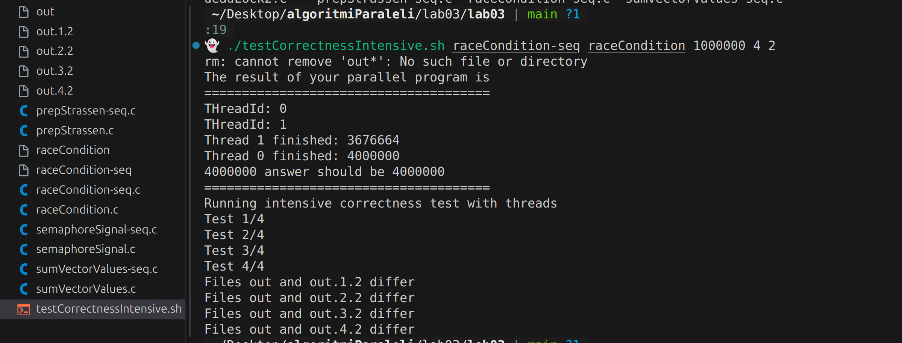
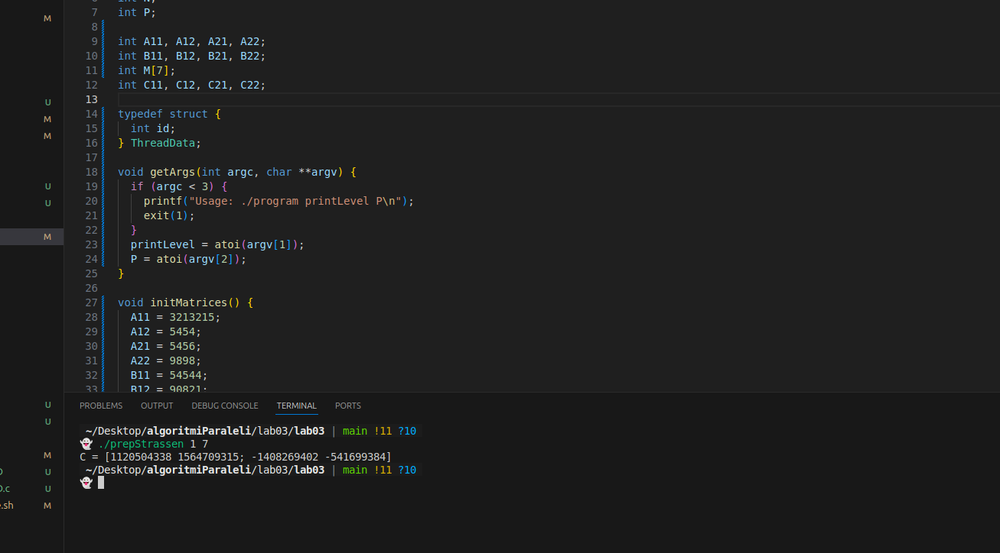
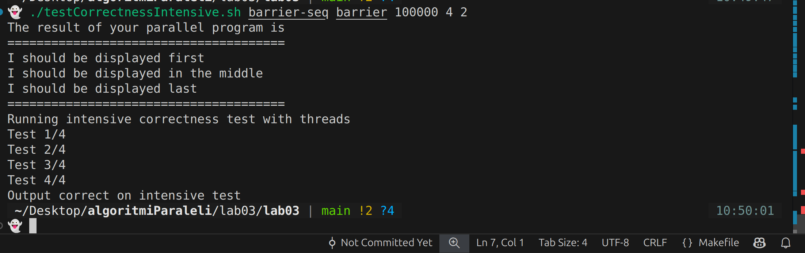
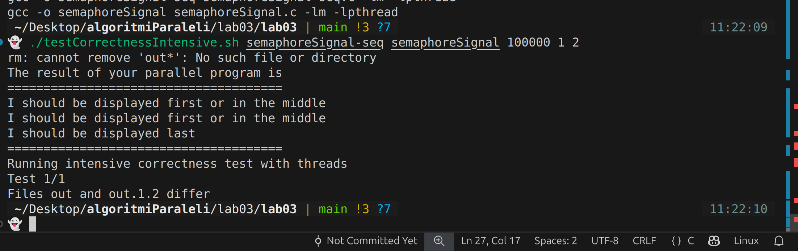
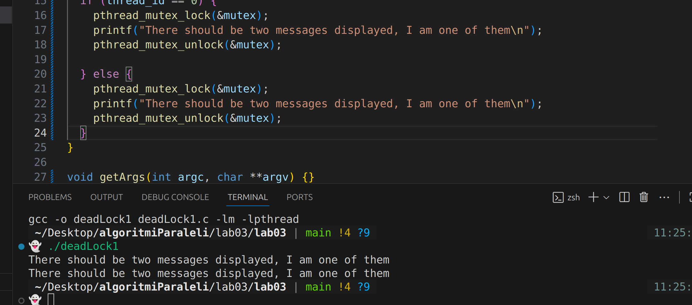
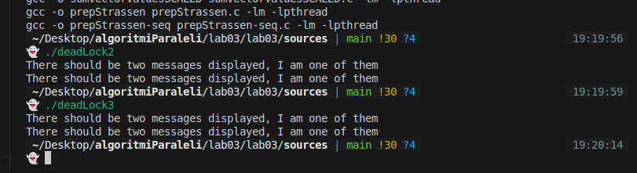
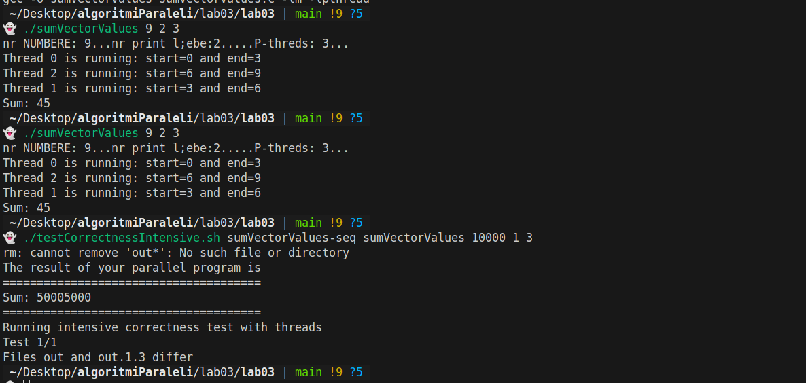
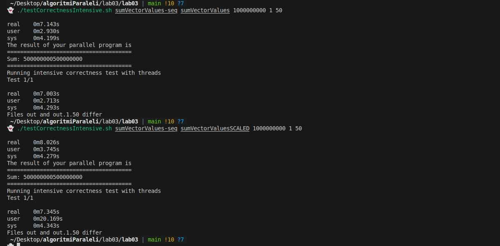

# Lab 03: Race Condition

## Instructiuni si explicatii pentru fiecare exercitiu (fara diacritice)

1) Race condition (raceCondition.c)
- Scop: arata efectul accesului concurent la o resursa partajata (ex: incrementari sau sumari).
- Imagine: 
- Ce sa faceti:
  - Compilati fara optimizari agresive (fara -O3):
    - gcc -pthread -o racecondition raceCondition.c
    - gcc -pthread -o racecondition-seq raceCondition-seq.c
  - Parametrii programului:
    - N = numarul de elemente (argument 1)
    - printLevel = cate elemente se printeaza (argument 2)
    - P = numarul de thread-uri (argument 3) — in cod se suprascrie cu 2
  - Rulare exemplu:
    - ./racecondition 10 10 2
  - Ce rezultat obtineti?
    - Rulare unica: poate parea corect, dar rezultatele sunt nedeterminate: elemente lipsa/valori duplicate sau sume incorecte.
  - Cu N mare (1000-10000):
    - Race-urile pot produce comportament vizibil (valori corupte, sume gresite).
  - Rulat de mai multe ori cu N = 1:
    - Se observa nondeterminism frecvent (uneori corect, alteori gresit).
  - Scop: intelegerea cauzei si identificarea comportamentului nedeterminist.

2) Testarea corectitudinii intensiva (testCorrectnessIntensive.sh)
- Scop: rula foarte multe iteratii ale programului paralel si compara cu versiunea secventiala.
- Imagine: 
- Parametrii script (exemplu):
  - ./sources/testCorrectnessIntensive.sh ./racecondition-seq ./racecondition N NUM_RUNS [thread_counts...]
  - Exemplu practic:
    - ./sources/testCorrectnessIntensive.sh ./racecondition-seq ./racecondition 1 10000 1 2 4 8
- Recomandare: folositi N mic (chiar 1) si NUM_RUNS mare (10000) pentru a detecta race-condition-uri.
- Ce rezultat obtineti?
  - Daca exista race, scriptul raporteaza discrepante intre versiunea secventiala si cea paralela.

3) Rezolvarea race condition cu mutex
- Solutie: protejati regiunea critica (actualizarea variabilelor partajate) cu pthread_mutex_lock / pthread_mutex_unlock.
- Testare: recompilati si rerulati scriptul de test intensiv; scriptul ar trebui sa nu raporteze discrepante dupa ce lock-urile sunt corect plasate.
- Imagine sugestiva: 

4) Modificati barrier.c pentru ordine fixa folosind bariere
- Scop: asigurati afisarea intr-o ordine determinista doar folosind bariere (fara mutex/semafoare).
- Testare: rulati scriptul intensiv (10000 iteratii) pentru a verifica determinismul.
- Imagine: 

5) Modificati semaphoreSignal.c pentru ordine fixa folosind semafoare
- Scop: asigurati afisarea intr-o ordine determinista doar folosind semafoare.
- Testare: rulati scriptul intensiv (10000 iteratii) pentru a verifica determinismul.
- Imagine: 

6) Rezolvati deadLock1.c fara a scoate lock de pe mutex
- Analiza: identificati ordinea gresita de achizitie a mutex-urilor care produce deadlock si schimbati ordinea sau folosiati mecanisme care previn ciclul.
- Intrebare: De ce avem dead lock?
  - Raspuns succint: doua thread-uri asteapta fiecare un mutex detinut de celalalt -> ciclul de asteptare (deadlock).
- Imagine: 

7) Rezolvati deadLock2.c fara a scoate lock de pe mutexA si mutexB
- Analiza: ordinea de lock intre mutexA si mutexB poate provoca deadlock; evitati ciclul de asteptare (ex: impuneti o ordonare globala a achizitiei).
- Intrebari:
  - De ce avem dead lock?
    - Acelasi motiv: asteptare circulare.
  - Mai avem si daca scoatem acele sleep-uri?
    - Sleep-urile doar cresc sansa de reproducere; eliminarea lor nu garanteaza evitarea deadlock-ului.
  - Rulati multe ori (100000) pentru a fi sigur.
- Imagine: 

8) Rezolvati deadLock3.c fara a scoate lock de pe mutex
- Analiza: posibil lock recursiv pe acelasi mutex sau dependinte care cauzeaza deadlock.
- Atentie: in unele implementari se poate face lock recursiv (dar standardul pthread_mutex nu e recursiv fara atribut special).
- Imagine: 

9) Paralelizati sumVectorValues.c
- Scop: impartiti vectorul intre thread-uri si acumulati partial, apoi combinati rezultatele.
- Masuratori: comparati timpul secvential vs paralel cu time ./program.
- Recomandare pentru timpi mari: rulati cu N = 1000000000 (1e9) pentru masuratori semnificative.
- Observatii: scalabilitatea depinde de costul per-element, overhead de creare/joins si memory bandwidth.
- Imagine: 

10) Implementati variant care scaleaza (optional)

- Am folosit un vector unde fiecare element este asociat unui thread seapart, astfel incat nu mai apare concurenta pe accesarea unei resurse, fiecar thread avand "box" ul de agregare a sumei separate
- Imagine: 

11) Paralelizati prepStrassen.c
- Scop: folositi mai multe functii pentru thread-uri si bariere pentru sincronizare.
- Atentie maxima la dependinte read-read, read-write, write-write.
- Afiisarea trebuie identica la oricate rulări.
- Testare: scriptul intensiv.

- Am reusit sa il rezolv doar cu 7 threaduri
- Imagine: 

---
