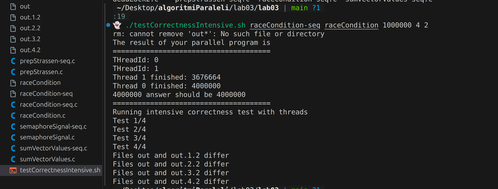

# Lab 03: Race Condition

## Continut

- `racecondition`: Implementare paralela.
- `racecondition-seq`: Implementare secventiala, fara race condition.
- `testulCorrectnessINtesibe.sh`: Script pentru testarea corectitudinii si identificarea comportamentului nedeterminist.
- `raceCondition.png`: Ilustratie vizuala a conceptului de race condition si rezultat script lab.

## Imagine explicativă

## Observații
### Imagini disponibile

#### Imagini disponibile

Acestă comandă afișează toate fișierele imagine disponibile în directorul curent.
- `racecondition` poate produce rezultate diferite la fiecare rulare din cauza accesului concurent la resurse partajate.
- `racecondition-seq` ofera rezultate deterministe.
